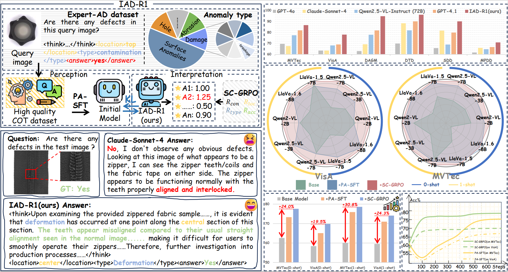

<h1 align="center">IAD-R1: Reinforcing Consistent Reasoning in Industrial Anomaly Detection</h1>
We propose IAD-R1, a universal post-training framework that enhances Vision-Language Models for industrial anomaly detection through a two-stage training strategy. 

<p align="center">
    </a>&nbsp&nbsp📔<a href="https://arxiv.org/abs/2508.09178"> Paper</a>&nbsp&nbsp │
    </a>&nbsp&nbsp🤖 <a href="https://huggingface.co/yanhui01/IAD-R1-Update/tree/main">Models</a>&nbsp&nbsp │
    </a>&nbsp&nbsp💾 <a href="https://huggingface.co/datasets/yanhui01/Expert-AD">Datasets</a>&nbsp&nbsp
</p>

## 🗞️ More Experiment Results
- We further refine the captions in the **Expert-AD** dataset and retrain the model, obtaining **IAD-R1-UPDATE**. Compared with IAD-R1, IAD-R1-UPDATE achieves consistently better **zero-shot** detection performance.
  - **IAD-R1-UPDATE (Qwen2.5-VL-Instruct-3B)** improves average accuracy by **2.7%** over IAD-R1 (Qwen2.5-VL-Instruct-3B).
  - **IAD-R1-UPDATE (Qwen2-VL-Instruct-2B)** improves average accuracy by **1.8%** over IAD-R1 (Qwen2-VL-Instruct-2B).
  - **IAD-R1-UPDATE (Qwen2.5-VL-Instruct-7B)** improves average accuracy by **1.2%** over IAD-R1 (Qwen2.5-VL-Instruct-7B).
  - Additional experimental results are provided in `supplementary_results/IAD-R1-UPDATE_Results`.
- We additionally report the zero-shot results of Qwen-VL-MAX on the six evaluation benchmarks; see `supplementary_results/Commercial-model_Results/qwen_vl_max`.
- We further include 2-shot and 4-shot results for both the pretrained models and their IAD-R1–finetuned counterparts; see `supplementary_results/Few-Shot-Settings_Results`.


## 🔥 Overview
Industrial anomaly detection is a critical component of modern manufacturing, yet the scarcity of defective samples restricts traditional detection methods to scenario-specific applications. Although Vision-Language Models (VLMs) demonstrate significant advantages in generalization capabilities, their performance in industrial anomaly detection remains limited. To address this challenge, we propose **IAD-R1**, a universal post-training framework applicable to VLMs of different architectures and parameter scales, which substantially enhances their anomaly detection capabilities. IAD-R1 employs a two-stage training strategy: the *Perception Activation Supervised Fine-Tuning (PA-SFT)* stage utilizes a meticulously constructed high-quality Chain-of-Thought dataset (**Expert-AD**) for training, enhancing anomaly perception capabilities and establishing reasoning-to-answer correlations; the *Structured Control Group Relative Policy Optimization (SC-GRPO)* stage employs carefully designed reward functions to achieve a capability leap from **"Anomaly Perception"** to **"Anomaly Interpretation"**. Experimental results demonstrate that IAD-R1 achieves significant improvements across 7 VLMs, the largest improvement was on the DAGM dataset, with average accuracy 43.3% higher than the 0.5B baseline. Notably, the 0.5B parameter model trained with IAD-R1 surpasses commercial models including GPT-4.1 and Claude-Sonnet-4 in zero-shot settings, demonstrating the effectiveness and superiority of IAD-R1.

<div align="center">

</div>


## 👾 IAD-R1 Model


|               |                   LLaVA-OneVision-SI-0.5B                    |                     Qwen2-VL-Instruct-2B                     |                    Qwen2.5-VL-Instruct-3B                    |                    Qwen2.5-VL-Instruct-7B                    |                         LLaVA-1.5-7B                         |                    LLaVA-OneVision-SI-7B                     |                         LLaVA-1.6-8B                         |
| ------------- | :----------------------------------------------------------: | :----------------------------------------------------------: | :----------------------------------------------------------: | :----------------------------------------------------------: | :----------------------------------------------------------: | :----------------------------------------------------------: | :----------------------------------------------------------: |
| IAD-R1        | [IAD-R1(LLaVA-OneVision-SI-0.5B)](https://huggingface.co/yanhui01/IAD-R1/tree/main/IAD-R1(LLaVA-OneVision-Si-0.5B)) | [IAD-R1(Qwen2-VL-Instruct-2B)](https://huggingface.co/yanhui01/IAD-R1/tree/main/IAD-R1(Qwen2-VL-Instruct-2B)) | [IAD-R1(Qwen2.5-VL-Instruct-3B)](https://huggingface.co/yanhui01/IAD-R1/tree/main/IAD-R1(Qwen2.5-VL-Instruct-3B)) | [IAD-R1(Qwen2.5-VL-Instruct-7B)](https://huggingface.co/yanhui01/IAD-R1/tree/main/IAD-R1(Qwen2.5-VL-Instruct-7B)) | [IAD-R1(LLaVA-1.5-7B)](https://huggingface.co/yanhui01/IAD-R1/tree/main/IAD-R1(LLaVA-1.5)) | [IAD-R1(LLaVA-OneVision-SI-7B)](https://huggingface.co/yanhui01/IAD-R1/tree/main/IAD-R1(LLaVA-OneVision-SI-7B)) | [IAD-R1(LLaVA-1.6-8B)](https://huggingface.co/yanhui01/IAD-R1/tree/main/IAD-R1(LLaVA-1.6)) |
| IAD-R1-UPDATE | [IAD-R1-UPDATE(LLaVA-OneVision-SI-0.5B)](https://huggingface.co/yanhui01/IAD-R1-UPDATE/tree/main/IAD-R1(LLaVA-OneVision-SI-0.5B)) | [IAD-R1-UPDATE(Qwen2-VL-Instruct-2B)](https://huggingface.co/yanhui01/IAD-R1-UPDATE/tree/main/IAD-R1(Qwen2-VL-Instruct-2B)) | [IAD-R1-UPDATE(Qwen2.5-VL-Instruct-3B)](https://huggingface.co/yanhui01/IAD-R1-UPDATE/tree/main/IAD-R1(Qwen2.5-VL-Instruct-3B)) | [IAD-R1-UPDATE(Qwen2.5-VL-Instruct-7B)](https://huggingface.co/yanhui01/IAD-R1-UPDATE/tree/main/IAD-R1(Qwen2.5-VL-Instruct-7B)) | [IAD-R1-UPDATE(LLaVA-1.5-7B)](https://huggingface.co/yanhui01/IAD-R1-UPDATE/tree/main/IAD-R1(LLaVA-1.5)) | [IAD-R1-UPDATE(LLaVA-OneVision-SI-7B)](https://huggingface.co/yanhui01/IAD-R1-UPDATE/tree/main/IAD-R1(LLaVA-OneVision-SI-7B)) | [IAD-R1-UPDATE(LLaVA-1.6-8B)](https://huggingface.co/yanhui01/IAD-R1-UPDATE/tree/main/IAD-R1(LLaVA-1.6)) |


##  🚀 Get Start

### 🛠️ Environment Configuration

```bash
# clone our project.
git clone https://github.com/Yanhui-Lee/IAD-R1.git
cd IAD-R1

# build conda env.
conda create -n IAD-R1 python=3.10
conda activate IAD-R1
pip install -r requirements.txt
```

### 🧰 Data Preparation

#### Training data

- Construct Training Dataset for PA-SFT, SC-GRPO.

**For *PA-SFT* training:**


```json
[
  {
      "images": "image_path",
      "messages": [
        {
          "role": "user",
          "content": "<image>\nAre there any defects in the query image?"
        },
        {
          "role": "assistant",
          "content": "<think>[Thinking process]</think><answer>No</answer>"
        }
      ]
  },
  {
      "images": "image_path",
      "messages": [
        {
          "role": "user",
          "content": "<image>\nAre there any defects in the query image?"
        },
        {
          "role": "assistant",
          "content": "<think>[Thinking process]</think><location>[Location]</location><type>[Type]</type><answer>Yes</answer>"
        }
      ]
  }
]
```

**For *SC-GRPO* training:**

```json
[
  {
      "id": "xxx",
      "image": "image_path",
      "problem": "Are there any defects in the query image?",
      "solution": "<answer>No</answer>"
  },
  {
      "id": "xxx",
      "image": "image_path",
      "problem": "Are there any defects in the query image?",
      "solution": "<location>[Location]</location><type>[Type]</type><answer>Yes</answer>"
  }
]
```

- We adopt a *zero-shot training setup* during the training process. If you want to use a one-shot training setup, you can follow the construction method below.

**For *PA-SFT* training:**
```json
[
  {
      "images": [
        "ref_image_path",   
        "query_image_path" 
      ],
      "messages": [
        {
          "role": "user",
          "content": "'few-shot prompt' + <image>\n<image>\nAre there any defects in the query image?"
        },
        {
          "role": "assistant",
          "content": "<think>[Thinking process]</think><location>[Location]</location><type>[Type]</type><answer>Yes</answer>"
        }
      ]
  }
]
```


**For *SC-GRPO* training:**
```json
[
  {
      "id": "xxx",
      "image": [
          "ref_image_path", 
          "query_image_path"
      ],
      "problem": "Are there any defects in the query image?",
      "solution": "<location>[Location]</location><type>[Type]</type><answer>Yes</answer>"
  }
]
```
`Don't forget to set '--single_img 0' in scripts (SC-GRPO stage) in order to use the prompts for 1-shot settings.`

#### Inference data

- [Download](https://huggingface.co/datasets/yanhui01/Industrial_test/tree/main) the test data we compiled and organize it according to the following format.

```shell
# Inference images
Industrial_test
├── DAGM/
│   ├── Class1
│   └── Class2
│   └── ...
├── DS-MVTec/
│   ├── bottle
│   └── cable
│   └── ...
├── DTD/
│   ├── Blotchy_099
│   └── Fibrous_183
│   └── ...
├── MPDD/
│   ├── bracket_black
│   └── bracket_brown
│   └── ...
├── SDD
│   ├── test
├── VisA/
│   ├── candle
│   └── capsules
│   └── ...

# Inference json
data/Test/
├── test_DAGM_format.json
├── test_MVTec_format.json
├── test_DTD_format.json
├── test_MPDD_format.json
├── test_SDD_format.json
├── test_VisA_format.json
```
- Construct your test dataset.

*Prepare meta.json for your dataset*
```json
{
    "category1":
    [
        {
            "img_path": "your image path",
            "mask_path": "",
            "cls_name": "object1",
            "specie_name": "good",
            "anomaly": 0
        },
        {
            "img_path": "your image path",
            "mask_path": "",
            "cls_name": "object2",
            "specie_name": "good",
            "anomaly": 0
        }
    ]
}
```
```shell
cd Industrial_test
python convert.py
```

###  🧠 Training

#### Model Preparation
- [LLaVA-OneVision-SI-0.5B](https://huggingface.co/llava-hf/llava-onevision-qwen2-0.5b-si-hf/tree/main)
- [Qwen2-VL-Instruct-2B](https://huggingface.co/Qwen/Qwen2-VL-2B-Instruct)
- [Qwen2.5-VL-Instruct-3B](https://huggingface.co/Qwen/Qwen2.5-VL-3B-Instruct/tree/main)
- [InternVL-2.5-4B](https://huggingface.co/OpenGVLab/InternVL2_5-4B/tree/main)
- [Qwen2.5-VL-Instruct-7B](https://huggingface.co/Qwen/Qwen2.5-VL-7B-Instruct/tree/main)
- [LLaVA-1.5-7B](https://huggingface.co/llava-hf/llava-1.5-7b-hf/tree/main)
- [LLaVA-OneVision-SI-7B](https://huggingface.co/llava-hf/llava-onevision-qwen2-7b-si-hf/tree/main)
- [LLaVA-1.6-8B(mistral)](https://huggingface.co/llava-hf/llava-v1.6-mistral-7b-hf/tree/main)
- [LLaVA-1.5-13B](https://huggingface.co/llava-hf/llava-1.5-13b-hf/tree/main)
- [LLaVA-1.6-34B](https://huggingface.co/llava-hf/llava-v1.6-34b-hf/tree/main)
- [Qwen2.5-VL-Instruct-72B](https://huggingface.co/Qwen/Qwen2.5-VL-72B-Instruct/tree/main)

*Download these models to your local project（final_model/Pretrain）.*

#### Perception Activation Supervised Fine-Tuning Stage Scripts
```shell
# PA-SFT Stage

## LLaVA-OneVision-SI-0.5B
bash scripts/train/PA_SFT/PA_SFT_LLaVA_OneVision_SI_0.5B.sh

## Qwen2-VL-Instruct
bash scripts/train/PA_SFT/PA_SFT_Qwen_Instruct_2_VL.sh

## Qwen2.5-VL-Instruct-3B
bash scripts/train/PA_SFT/PA_SFT_Qwen_Instruct_2_5_VL_3B.sh

## Qwen2.5-VL-Instruct-7B
bash scripts/train/PA_SFT/PA_SFT_Qwen_Instruct_2_5_VL_7B.sh

## LLaVA-1.5
bash scripts/train/PA_SFT/PA_SFT_LLaVA_1_5.sh

## LLaVA-OneVision-SI-7B
bash scripts/train/PA_SFT/PA_SFT_LLaVA_OneVision_SI_7B.sh

## LLaVA-1.6(LLaVA-next)
bash scripts/train/PA_SFT/PA_SFT_LLaVA_1_6.sh
```
#### Structured Control Group Relative Policy Optimization Stage Scripts

```shell
# SC-GRPO Stage

## LLaVA-OneVision-SI-0.5B
bash scripts/train/SC_GRPO/SC_GRPO_LLaVA_OneVision_SI_0.5B.sh

## Qwen2-VL-Instruct
bash scripts/train/SC_GRPO/SC_GRPO_Qwen_Instruct_2_VL.sh

## Qwen2.5-VL-Instruct-3B
bash scripts/train/SC_GRPO/SC_GRPO_Qwen_Instruct_2_5_VL_3B.sh

## Qwen2.5-VL-Instruct-7B
bash scripts/train/SC_GRPO/SC_GRPO_Qwen_Instruct_2_5_VL_7B.sh

## LLaVA-1.5
bash scripts/train/SC_GRPO/SC_GRPO_LLaVA_1_5.sh

## LLaVA-OneVision-SI-7B
bash scripts/train/SC_GRPO/SC_GRPO_LLaVA_OneVision_SI_7B.sh

## LLaVA-1.6(LLaVA-next)
bash scripts/train/SC_GRPO/SC_GRPO_LLaVA_1_6.sh
```

### 📊 Inference
- Commercial Model Inference Scripts.
```shell
# Commercial Model Inference

## OpenAI
### GPT 4.1
bash scripts/Inference/Commercial-Inference/ChatGPT_4.1_Inference.sh

### GPT 4.1-mini
bash scripts/Inference/Commercial-Inference/ChatGPT_4.1_mini_Inference.sh

### GPT 4.1-nano
bash scripts/Inference/Commercial-Inference/ChatGPT_4.1_nano_Inference.sh

### GPT 4o
bash scripts/Inference/Commercial-Inference/Chatgpt_4o_Inference.sh

### GPT 4o-mini
bash scripts/Inference/Commercial-Inference/ChatGPT_4o_mini_Inference.sh

## Claude-Sonnet-4
bash scripts/Inference/Commercial-Inference/Claude_Sonnet_4_Inference.sh

## Qwen-VL-MAX
bash scripts/Inference/Commercial-Inference/Qwen_VL_MAX_Inference.sh
```
- Pretrain Model Inference Scripts.
```shell
# Pretrain Model Inference

## LLaVA-OneVision-SI-0.5B
bash scripts/Inference/Pretrain-Inference/vLLM_LLaVA_OneVision_SI_0_5_B_Inference.sh

# Qwen2-VL-Instruct-2B
bash scripts/Inference/Pretrain-Inference/vLLM_Qwen2_VL_Instruct_2B_Inference.sh

## Qwen2.5-VL-Instruct-3B
bash scripts/Inference/Pretrain-Inference/vLLM_Qwen2_5_VL_Instruct_3B_Inference.sh

## InternVL-2.5-4B
bash scripts/Inference/Pretrain-Inference/vLLM_InternVL_2_5_4B_Inference.sh

## Qwen2.5-VL-Instruct-7B
bash scripts/Inference/Pretrain-Inference/vLLM_Qwen2_5_VL_Instruct_7B_Inference.sh

## LLaVA-OneVision-SI-7B
bash scripts/Inference/Pretrain-Inference/vLLM_LLaVA_OneVision_SI_7B_Inference.sh

## LLaVA-1.5-7B
bash scripts/Inference/Pretrain-Inference/vLLM_LLaVA_1_5_7B_Inference.sh

## LLaVA-1.6(mistral)-8B
bash scripts/Inference/Pretrain-Inference/vLLM_LLaVA_1_6_8B_Inference.sh

## LLaVA-1.5-13B
bash scripts/Inference/Pretrain-Inference/vLLM_LLaVA_1_5_13B_Inference.sh

## LLaVA-1.6-34B
bash scripts/Inference/Pretrain-Inference/vLLM_LLaVA_1_6_34B_Inference.sh

## Qwen2.5-VL-Instruct-72B
bash scripts/Inference/Pretrain-Inference/vLLM_Qwen2_5_VL_Instruct_72B_Inference.sh
```
- IAD-R1 Model Inference Scripts.
```shell
# IAD-R1 Model Inference 

## LLaVA-OneVision-SI-0.5B
bash scripts/Inference/IAD-R1-Inference/vLLM_LLaVA_OneVision_SI_0_5_B_Inference.sh

# Qwen2-VL-Instruct-2B
bash scripts/Inference/IAD-R1-Inference/vLLM_Qwen2_VL_Instruct_Inference.sh

## Qwen2.5-VL-Instruct-3B
bash scripts/Inference/IAD-R1-Inference/vLLM_Qwen2_5_VL_Instruct_3B_Inference.sh

## Qwen2.5-VL-Instruct-7B
bash scripts/Inference/IAD-R1-Inference/vLLM_Qwen2_5_VL_Instruct_7B_Inference.sh

## LLaVA-1.5-7B
bash scripts/Inference/IAD-R1-Inference/vLLM_LLaVA_1_5_Inference.sh

## LLaVA-OneVision-SI-7B
bash scripts/Inference/IAD-R1-Inference/vLLM_LLaVA_OneVision_SI_7B_Inference.sh

## LLaVA-1.6(mistral)-8B
bash scripts/Inference/IAD-R1-Inference/vLLM_LLaVA_1_6_Inference.sh
```
- Open-source Model Inference Script.
```shell
# Open-source Model Inference

## Anomaly-R1
bash scripts/Inference/Anomaly-R1-Inference/Anomaly-R1-Inference.sh
```