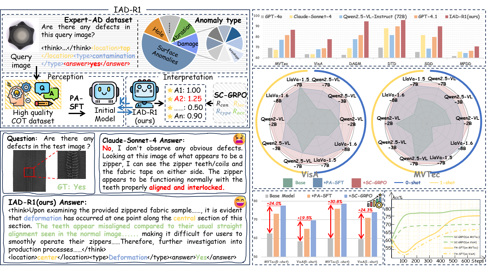
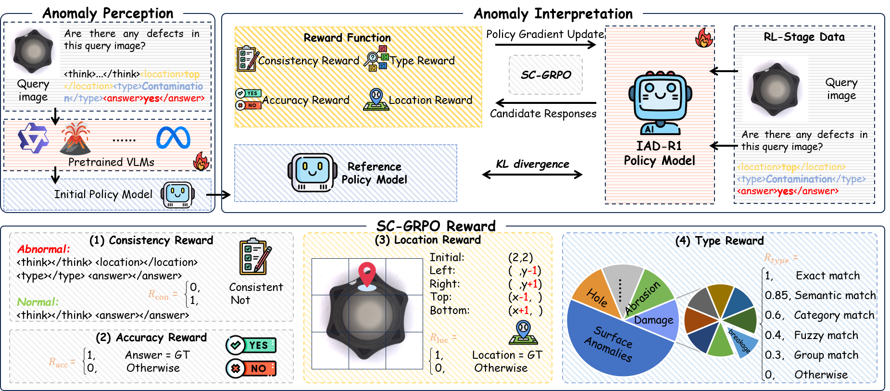
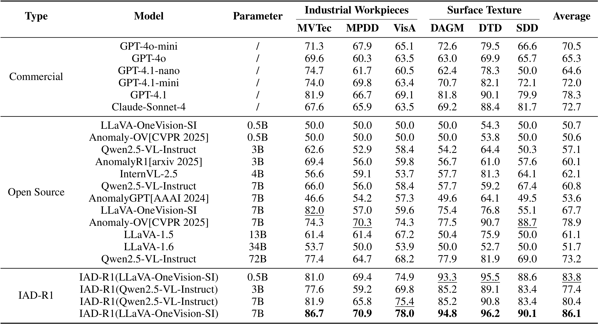
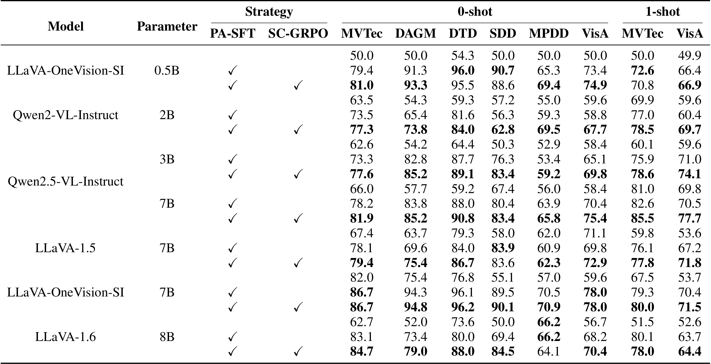

# IAD-R1
We proposes IAD-R1, a universal post-training framework that enhances Vision-Language Models for industrial anomaly detection through a two-stage training strategy. 
**The code, datasets, and all model weights will be released publicly upon acceptance of this paper.** 

📓[IAD-R1 ArXiv Paper]()
💾[Expert-AD Dataset](https://huggingface.co/datasets/yanhui01/Expert-AD)
🤖[IAD-R1 Model](https://huggingface.co/yanhui01/IAD-R1)

## Overall
🤯🤯🤯

**Overview of IAD-R1.** The top left panel illustrates the composition of the Expert-AD and the two-stage training framework of IAD-R1. The bottom left panel shows an output example of IAD-R1 for anomaly detection. The right panels present quantitative analyses showcasing the performance of IAD-R1 across different model confgurations and datasets.

## Architecture

**Architecture of IAD-R1.** IAD-R1 employs a progressive two-stage training strategy: First, in the PA-SFT stage, supervised fine-tuning is conducted on pre-trained VLMs using CoT reasoning samples from the Expert-AD dataset to enhance the model's anomaly perception capabilities and establish structured reasoning pathways; Subsequently, in the SC-GRPO stage, reward functions across four dimensions (consistency, accuracy, location, and type) are designed as reinforcement learning objectives to optimize the policy model, thereby improving its anomaly detection and understanding capabilities.

## Experiments

## Todo list
- [x] Release our IAD-R1 paper
- [ ] Release our Code
- [ ] Release our Expert-AD dataset
- [ ] Release our model weights
- [ ] ...
